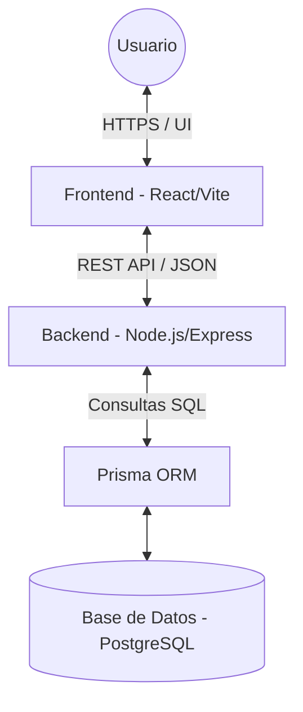
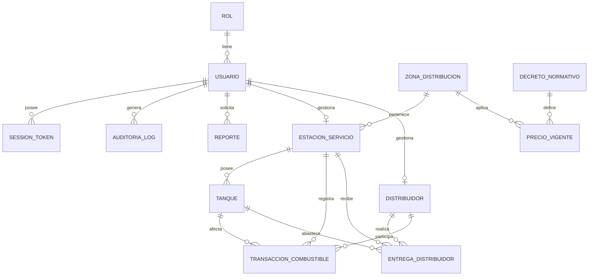
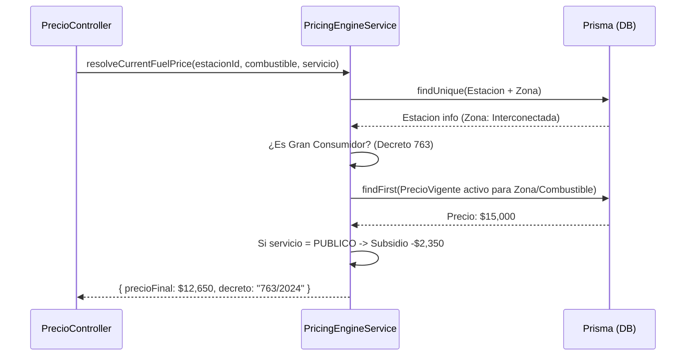
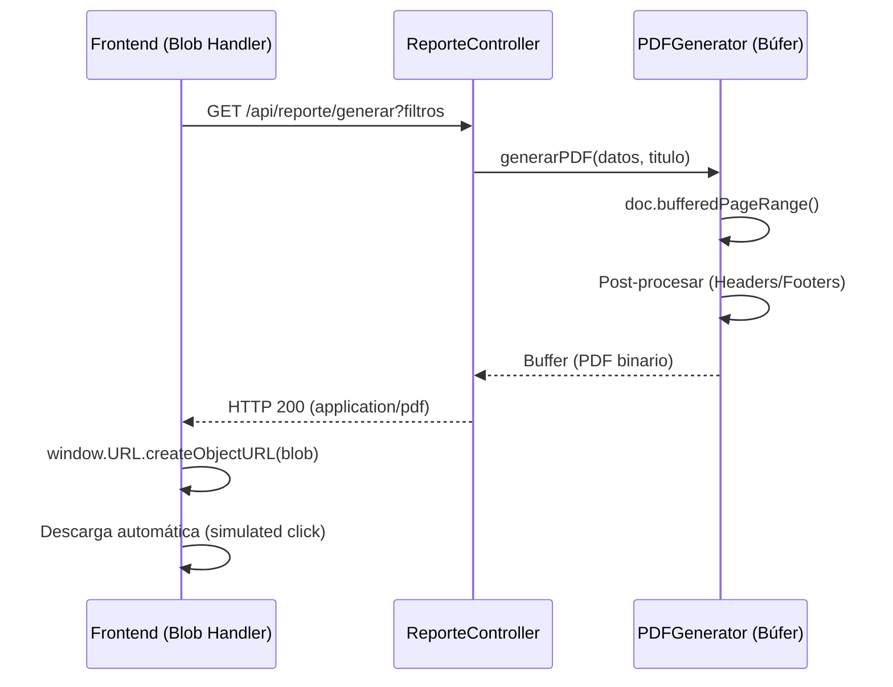
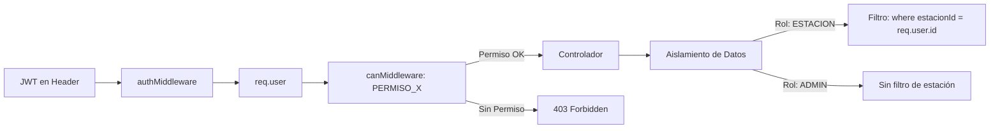

# Documento de Arquitectura de Sistema: EasyDiesel

## 1. Introducción
Este documento describe la arquitectura técnica del sistema EasyDiesel, detallando la interacción entre el Frontend (React) y el Backend (Node.js/Express). El objetivo es proporcionar una guía clara para que cualquier desarrollador pueda comprender la lógica de comunicación, los protocolos y la estructura de capas del sistema para su implementación o mantenimiento.

---

## 2. Arquitectura General (Alto Nivel)
EasyDiesel sigue un modelo de arquitectura **Cliente-Servidor** desacoplado:

---

## 3. Modelo de Datos (ERD)
El sistema utiliza un esquema relacional para garantizar la integridad de los datos transaccionales y normativos.

---

## 4. Protocolos y Formatos de Intercambio
La comunicación entre capas se rige por los siguientes estándares:

- **Protocolo**: HTTPS para todas las peticiones.
- **Arquitectura de API**: RESTful.
- **Formato de Datos**: JSON (JavaScript Object Notation) para el intercambio de información.
- **Autenticación**: JWT (JSON Web Tokens). El token se envía en el encabezado `Authorization: Bearer <token>`.
- **Codificación de Archivos**: Los reportes (PDF/Excel) se transfieren como `Blobs` (Binary Large Objects) desde el servidor al cliente.

---

## 4. Estructura de Capas del Backend
El backend está organizado en una arquitectura de N-capas para separar responsabilidades:

1.  **Capa de Rutas (`routes/`)**: Puntos de entrada de la API. Definen los endpoints y asocian middlewares (Auth/RBAC) y controladores.
2.  **Capa de Controladores (`controllers/`)**: Orquestadores de la petición. Reciben el `req`, llaman a la validación, invocan al servicio y devuelven la respuesta `res`.
3.  **Capa de Validadores (`validators/`)**: Utiliza **Zod** para asegurar que los datos de entrada cumplan con el esquema requerido antes de procesarlos.
4.  **Capa de Servicios (`services/`)**: Contiene la **Lógica de Negocio**. Aquí residen algoritmos como el Motor de Precios o la gestión de saldos de tanques.
5.  **Capa de Persistencia (`utils/prisma.ts`)**: Utiliza **Prisma ORM** para interactuar con PostgreSQL de forma tipada.

---

## 5. Estructura de Capas del Frontend
El frontend está diseñado para ser modular y reactivo:

1.  **Servicios de API (`services/api.ts`)**: Instancia central de Axios con interceptores para inyectar automáticamente el token JWT en cada petición.
2.  **Contexto de Autenticación (`context/AuthContext.tsx`)**: Gestiona el estado global del usuario, permisos y persistencia de la sesión (LocalStorage).
3.  **Hooks de Consumo**: Encapsulan la lógica de llamadas a la API, permitiendo que los componentes se enfoquen solo en la visualización.
4.  **Componentes UI Atómicos**: Botones, modales y tablas reutilizables que mantienen la consistencia visual.

---

## 6. Flujos de Datos Críticos

### 6.1 Proceso de Autenticación
1.  **Frontend**: El usuario envía credenciales al endpoint `/api/auth/login`.
2.  **Backend**: El controlador valida el usuario, genera un JWT y lo devuelve.
3.  **Frontend**: Almacena el JWT y redirige al Dashboard. A partir de aquí, cada petición incluye el token.

### 6.2 Lógica del Motor de Precios
Cuando se registra una venta, el motor resuelve el precio dinámicamente:

1.  El sistema identifica la **Estación** y su **Zona de Distribución**.
2.  Busca el **Precio Vigente** según el combustible y tipo de servicio (Particular/Público).
3.  Aplica reglas de decretos (ej: Descuento por subsidio de $2,350 si es servicio Público).
4.  Calcula el `precioTotal` basado en los galones ingresados.

### 6.3 Generación de Reportes
El flujo de generación evita sobrecarga en el servidor al no persistir archivos temporales:

1.  **Petición**: El frontend solicita un reporte con filtros de fecha.
2.  **Procesamiento**: El backend genera el PDF en memoria usando un búfer para evitar archivos temporales en el servidor.
3.  **Descarga**: El frontend recibe el búfer, crea un objeto URL temporal y dispara la descarga en el navegador del usuario.

---

## 7. Seguridad y RBAC (Role-Based Access Control)
El sistema utiliza una matriz de permisos para controlar el acceso:

- **Roles**: Admin, Estación, Distribuidor, Auditor, etc.
- **Middleware `can`**: Verifica en cada ruta si el rol del usuario tiene el permiso necesario (ej: `REPORTE_GENERAR`).
- **Aislamiento de Datos**: Para usuarios de rol `ESTACION`, el sistema inyecta automáticamente su `estacionId` en todas las consultas de base de datos, impidiendo el acceso a datos de terceros.

---

## 8. Manejo de Errores
- **Errores de Validación (400)**: Devueltos por Zod cuando el formato de datos es incorrecto.
- **Errores de Autenticación (401/403)**: Token inválido o permisos insuficientes.
- **Errores de Negocio (422/404)**: Saldo insuficiente en tanques o recurso no encontrado.
- **Errores de Servidor (500)**: Capturados por un middleware global que registra el error y devuelve un mensaje genérico al cliente.
