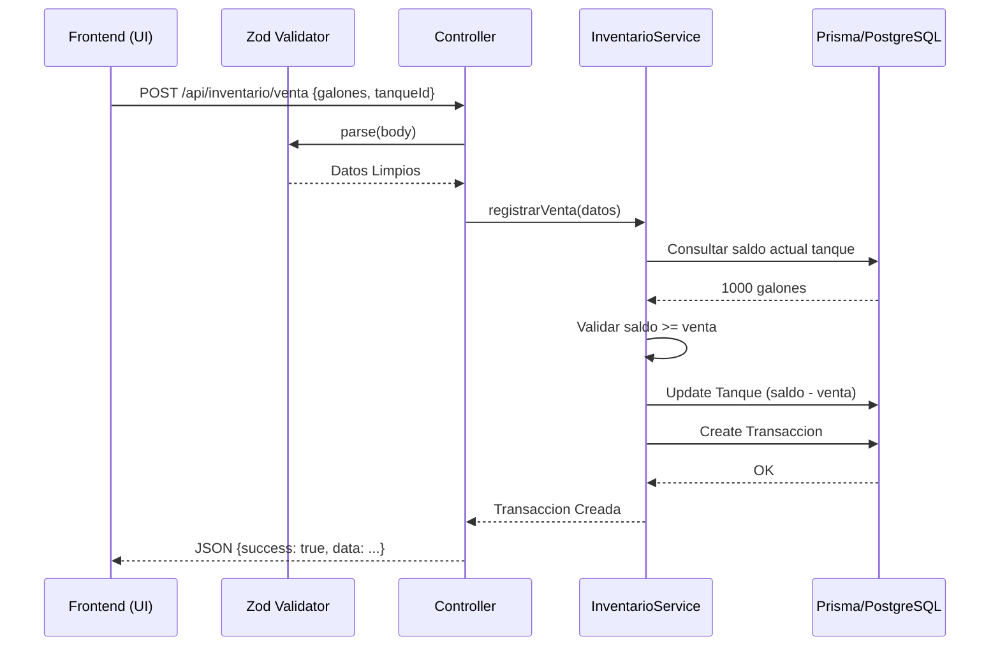

# Especificación Técnica y Conceptual: EasyDiesel

## 1. Modelo de Datos Detallado (Core Entities)

El sistema utiliza **Prisma ORM** sobre **PostgreSQL**. A continuación, los modelos críticos con sus tipos y restricciones reales:

| Entidad | Campos Clave | Relaciones |
| :--- | :--- | :--- |
| **`EstacionServicio`** | `nit` (unique), `codigoSicom` (unique), `latitud/longitud` (Decimal 9,6) | Belongs to `ZonaDistribucion`, Has many `Tanque` |
| **`Tanque`** | `capacidadGalones` (Decimal 10,2), `nivelActual` (Decimal 10,2), `tipoCombustible` (Enum) | Belongs to `EstacionServicio` |
| **`Transaccion`** | `galones` (Decimal 10,3), `precioUnitario`, `subsidioAplicado` (Boolean) | References `Tanque`, `Estacion`, `Decreto` |
| **`PrecioVigente`** | `precioGalon`, `subsidioGalon`, `vigenciaDesde`, `activo` (Boolean) | References `Zona`, `Decreto` |

---

## 2. Lógica de Componentes de Backend (Deep Dive)

### 2.1 El Motor de Precios (`PricingEngineService`)
Este servicio resuelve el precio de venta final aplicando el **Decreto 763/2024** y subsidios estatales:
1.  **Detección de Zona**: Localiza la zona de la estación (ej: Interconectada vs No Interconectada).
2.  **Lógica de Gran Consumidor**: 
    - Si `tipoCombustible = ACPM` y el cliente es `Gran Consumidor` en zona interconectada:
    - Se ignora el precio de `PUBLICO` y se aplica el de **Paridad Internacional** (`PARTICULAR`).
3.  **Inyección de Subsidio**:
    - Si `tipoServicio = PUBLICO`, el motor inyecta automáticamente un descuento de **$2,350 COP/galón**.
    - Para otros servicios, el subsidio es $0.
4.  **Trazabilidad**: El sistema guarda el ID del decreto aplicado en cada transacción para auditoría.

### 2.2 Generador de Reportes PDF (`pdfGenerator.ts`)
Para manejar reportes de gran volumen (40+ páginas) sin errores de renderizado, se utiliza un modelo de **Post-procesamiento de Búfer**:
- **`bufferPages: true`**: Permite a PDFKit generar todas las páginas en memoria antes de finalizar.
- **Cálculo Dinámico de Altura**: Cada fila de la tabla calcula su `heightOfString`. Si excede el `BOTTOM_LIMIT`, se dispara `doc.addPage()`.
- **Post-Decoración**: Una vez generado el contenido, el sistema recorre el rango de páginas (`doc.bufferedPageRange()`) para:
    1.  `doc.switchToPage(i)`
    2.  Dibujar el encabezado corporativo.
    3.  Estampar el pie de página con el contador real: `Página X de N`.

### 2.3 Seguridad: Inyección de Contexto de Estación
El sistema implementa un filtro de seguridad en la capa de **Servicio/Repositorio**:
```typescript
// Ejemplo de lógica en InventarioService
const where: Prisma.TransaccionWhereInput = {
    // Si el usuario es de rol ESTACION, forzamos el filtro por su ID
    ...(user.rol === 'ESTACION' ? { estacionId: user.estacionId } : {})
};
```
Esto garantiza que un administrador de estación **nunca** vea datos de otra, incluso si intenta manipular los parámetros de la URL.

---

## 3. Arquitectura del Frontend (React Logic)

### 3.1 Flujo de Consumo de API
El frontend no hace peticiones directas con `fetch`. Utiliza una estructura jerárquica:
1. **`api.ts` (Instancia Axios)**: Configura la `baseURL` y los interceptores para añadir el token `Bearer`.
2. **Custom Hooks (ej: `useInventario`)**: Encapsulan la llamada a la API, manejan el estado de `loading` y `error`.
3. **Componentes de Página**: Invocan al hook y renderizan la UI.

### 3.2 Lógica de Generación de Archivos (Blobs)
Cuando el usuario genera un reporte:
1. El frontend envía los filtros al backend.
2. El backend responde con un `Buffer` binario.
3. El frontend recibe este flujo como un `Blob` (Binary Large Object).
4. Se crea un enlace temporal en memoria: `window.URL.createObjectURL(blob)`.
5. Se simula un clic en ese enlace para descargar el archivo (PDF/Excel) sin recargar la página.

---

## 4. Calidad y Validación de Datos

### 4.1 Validación con Zod
El sistema no confía en la entrada del usuario. Cada endpoint utiliza un esquema de **Zod** para validar:
- **Tipos**: Asegura que `galones` sea un número positivo.
- **Formato**: Valida correos electrónicos y estructuras de UUID.
- **Lógica**: Impide que se registren ventas con fecha futura.

### 4.2 Estrategia de Pruebas Unitarias
Para garantizar la estabilidad sin depender de una base de datos real, se utiliza **Mocking**:
- **`jest-mock-extended`**: Crea un clon falso de `PrismaClient`.
- **Inyección de Dependencias**: Los servicios reciben este cliente mockeado, permitiendo simular escenarios de error (ej: "Tanque no encontrado") o de éxito sin afectar datos reales.
- **Cobertura**: El sistema mantiene un >80% de cobertura en servicios críticos como `Actor`, `Auth` y `Pricing`.

---

## 5. Diagrama de Proceso: Ciclo de una Transacción
Este diagrama muestra cómo interactúan las capas cuando se registra una venta:



---

## 5. Estructura de Carpetas y Responsabilidades

- **`backend/src/services/`**: Donde vive la inteligencia del sistema (Clases de lógica).
- **`backend/src/controllers/`**: Manejadores de rutas que gestionan la comunicación HTTP.
- **`backend/src/utils/`**: Herramientas transversales (Generadores de archivos, Seguridad).
- **`frontend/src/components/ui/`**: Librería de componentes visuales atómicos (Botones, Inputs).
- **`frontend/src/context/`**: Gestión del estado global (Autenticación).
- **`frontend/src/pages/`**: Ensamblado de componentes para formar pantallas de negocio.
